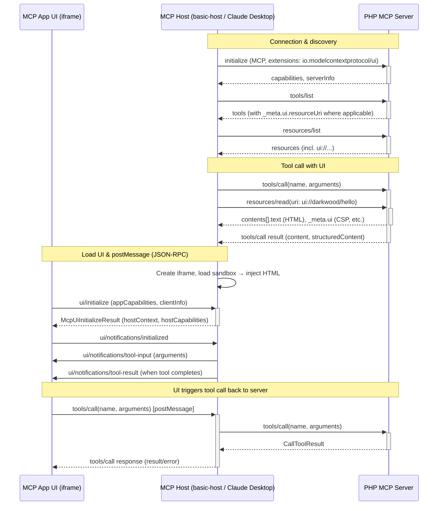

# PHP MCP Server + MCP Apps — Minimal MVP Architecture

This document describes the runtime flow for the **PHP MCP Server** that supports the MCP Apps extension (2026-01-26), with a host such as **basic-host** (from ext-apps) or **Claude Desktop** rendering a UI resource (e.g. `ui://darkwood/hello`) in a sandboxed iframe. Communication is JSON-RPC: UI ↔ host over `postMessage`, host ↔ server over **stdio** or **HTTP** (MCP).

For an overview of usage modes (stdio, HTTP, Symfony server, Claude Desktop extension), run commands, and limitations, see the main [README](../README.md).

---

## 1. Architecture diagram

---

## 2. Role of the components

### MCP host

The **MCP host** (e.g. ext-apps basic-host, or Claude Desktop when it supports MCP Apps) connects to the PHP MCP server over **stdio** or **HTTP**. It discovers tools and resources, invokes tools, and for tools with `_meta.ui.resourceUri` it also fetches the UI resource and renders it in an iframe. The host mediates all communication between the **MCP App UI** and the **PHP MCP server** (the UI never talks to the server directly).

### MCP App UI (View)

The **View** is the HTML/JS document served via **resources/read** for `ui://` URIs (e.g. `ui://darkwood/hello`, `ui://darkwood/article`). It runs inside the host’s iframe and communicates only with the host via **postMessage** (JSON-RPC 2.0, MCP Apps protocol). It receives tool input and tool results from the host and can issue **tools/call** requests that the host forwards to the PHP MCP server.

### PHP MCP server

The **PHP MCP server** (this project) implements the same MCP logic regardless of transport: `initialize`, `tools/list`, `tools/call`, `resources/list`, `resources/read`. It exposes tools (e.g. `hello_ui`, `GenerateDraft`, `PublishDraft`) with optional `_meta.ui.resourceUri` and serves the corresponding UI HTML via **resources/read**. Entry points:

- **Stdio:** `server.php` — line-delimited JSON-RPC on STDIN/STDOUT.
- **HTTP:** `bin/flow-worker.php` (embedded HTTP server) or `public/index.php` (e.g. under Symfony server or `php -S`).

### Flow

**Flow** is the optional orchestration layer used for multi-step workflows (e.g. article draft/publish). It is used when the server runs as **flow-worker** (`bin/flow-worker.php`), which runs the MCP HTTP handler and a periodic tick in one process. When the server is run via **Symfony server** or `php -S` with `public/index.php`, there is no in-process Flow worker; each request is synchronous.

---

## 3. Differences between stdio, HTTP, and Symfony-server usage

| Aspect | Stdio (`server.php`) | HTTP (flow-worker) | HTTP (Symfony server / `php -S`) |
|--------|----------------------|--------------------|-----------------------------------|
| **Transport** | STDIN/STDOUT, line-delimited JSON-RPC | POST /mcp, single JSON-RPC body | Same as HTTP |
| **Process** | One long-lived process | One long-lived process (HTTP + optional tick) | One PHP run per request |
| **Flow** | Same MCP+Flow wiring; no HTTP | Tick loop in same process | No Flow worker in process |
| **Typical use** | Claude Desktop (.mcpb), CLI | basic-host, local HTTP clients | Dev/deploy behind a web server |

- **Stdio:** Used by the Claude Desktop extension (.mcpb). The host starts `php server.php` and communicates over STDIN/STDOUT. No HTTP; no port.
- **HTTP (flow-worker):** Single process listening on a port (e.g. 3000); MCP endpoint at `/mcp`. Suitable for basic-host or other HTTP MCP clients; optional async/tick in the same process.
- **HTTP (Symfony server):** `public/index.php` handles POST /mcp; each request is independent. No built-in Flow worker; orchestration is per-request or external.

---

## 4. Position of Claude Desktop / extension in the architecture

The **Claude Desktop extension** is a packaging of the same PHP MCP server for use inside Claude / Claude Desktop:

- The extension is a **.mcpb** bundle whose manifest runs the server via **stdio** (`php server.php`).
- Claude Desktop acts as the **MCP host**: it starts the server subprocess, sends JSON-RPC over STDIN, and reads responses from STDOUT. When Claude supports MCP Apps, it can also fetch UI resources and render the View (iframe); otherwise only tool results (text) are shown.
- So in the architecture diagram, **Host** can be “Claude Desktop” when using the extension; the **Server** is still the same PHP MCP server, with transport = stdio instead of HTTP.

---

## 5. When a tool with `_meta.ui.resourceUri` is called

- The host discovers UI-enabled tools from **tools/list**: each tool may have `_meta.ui.resourceUri` set to a `ui://` URI (e.g. `ui://darkwood/hello`).
- When the user or agent invokes that tool, the host:
  1. Sends **tools/call** to the PHP server with the tool name and arguments.
  2. Uses the tool’s `_meta.ui.resourceUri` to fetch the UI resource (**resources/read**).

So the host both runs the tool on the server and loads the declared UI so it can show an interactive view tied to that tool call.

### How the host loads the UI via resources/read

- The host calls **resources/read** with the UI resource URI (e.g. `ui://darkwood/hello`).
- The PHP server responds with a **resources/read** result whose `contents[0]` has:
  - **uri**: same `ui://` URI
  - **mimeType**: `text/html;profile=mcp-app`
  - **text** or **blob**: the HTML document for the app
  - **_meta.ui** (optional): CSP (`connectDomains`, `resourceDomains`, etc.), `permissions`, `prefersBorder`, etc.
- The host then renders that HTML in a sandboxed iframe and communicates with the UI over **postMessage** (JSON-RPC 2.0, MCP Apps protocol).

The UI is not loaded by navigating the iframe to an HTTP URL on the PHP server; it is loaded by the host after fetching the document via **resources/read** and injecting it into the sandbox.

### How the UI communicates with the host

- All UI ↔ host communication is **JSON-RPC 2.0 over postMessage**: the UI sends requests/notifications to `window.parent`, and the host sends responses/notifications back.
- Lifecycle: UI sends **ui/initialize**; host responds with **McpUiInitializeResult**. UI sends **ui/notifications/initialized** when ready. Host sends **ui/notifications/tool-input** and later **ui/notifications/tool-result** (or **ui/notifications/tool-cancelled**).
- The UI can also send **notifications/message**, **ui/message**, **ui/update-model-context**, **ui/open-link**, **ui/request-display-mode**, etc., as in the 2026-01-26 spec.

### How the UI triggers tool calls back to the MCP server

- The UI sends a **tools/call** request over the same postMessage channel.
- The host (e.g. basic-host) uses **AppBridge** to forward **tools/call** to the MCP client connected to the PHP server and returns the **CallToolResult** (or error) to the UI.
- The server may expose tools with **visibility: ["app"]** (or **["model", "app"]**); only tools that include `"app"` in visibility are callable from the UI.

End-to-end: **UI → (postMessage) → Host → (stdio or HTTP MCP) → PHP Server → response back along the same path.**

**Tool result shape:** The host returns the server’s `CallToolResult` to the UI. The generated text is in **`result.content[0].text`** (single text item; `content` is an array of `{ type, text }`).

---

## 6. References

- **README:** [../README.md](../README.md) — usage modes, transports, run commands, limitations.
- **MCP Apps spec:** `specification/2026-01-26/apps.mdx` in the [ext-apps](https://github.com/modelcontextprotocol/ext-apps) repo (extension `io.modelcontextprotocol/ui`).
- **basic-host:** reference host in `examples/basic-host` (loads UI via **resources/read**, sandbox proxy, AppBridge, forwards **tools/call** from the UI to the MCP server).
- **Lifecycle:** Connection & discovery → UI initialization (sandbox, **ui/initialize**) → tool-input / tool-result → interactive phase (UI-originated **tools/call**, etc.) → **ui/resource-teardown** on cleanup.
